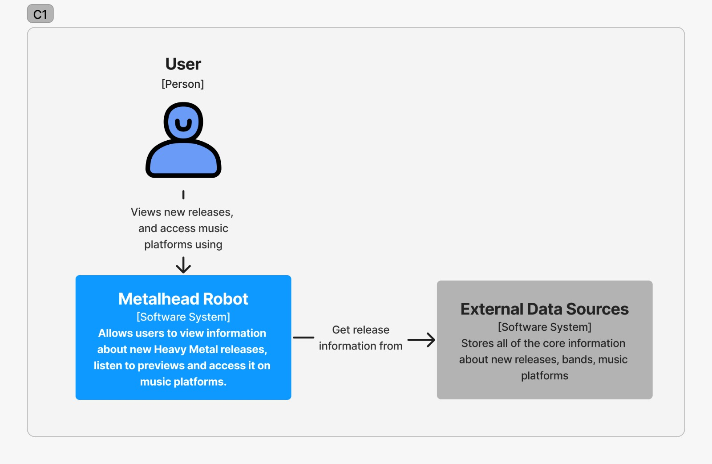
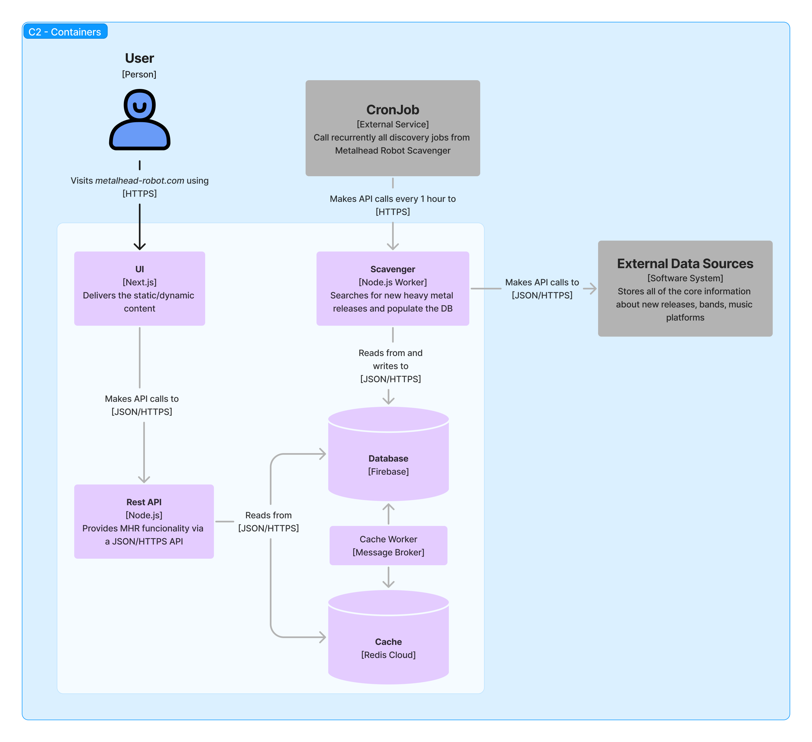

# Metalhead Robot Wiki - Architecture

| [Home](../README.md) | Architecture | [Git](../git/README.md) | [Configuration](../configuration/README.md) | [Mockups](../mockups/README.md) | [Database](../database/README.md) | [Project Management](../project-management/README.md) | [Quality](../quality/README.md) |
| :------------------: | :----------: | :---------------------: | :-----------------------------------------: | :-----------------------------: | :-------------------------------: | :---------------------------------------------------: | :-----------------------------: |

- [Metalhead Robot Wiki - Architecture](#metalhead-robot-wiki---architecture)
  - [Architecture](#architecture)
    - [Technologies Definition](#technologies-definition)
    - [C1 - Context Diagram](#c1---context-diagram)
    - [C2 - Container Diagram](#c2---container-diagram)
      - [Overview](#overview)
      - [Scavenger - Microservices](#scavenger---microservices)
      - [Scavenger - Monolithic](#scavenger---monolithic)
    - [C3 - Components Diagram](#c3---components-diagram)
      - [UI](#ui)
      - [API](#api)
      - [Scavenger](#scavenger)
    - [C4 - Code Diagram](#c4---code-diagram)
    - [Deploy Diagram](#deploy-diagram)
    - [Rest API Routes](#rest-api-routes)
    - [DB Collection Structure](#db-collection-structure)

## Architecture

This section will cover the architecture of Metalhead Robot. To build the architecture diagrams, we used the C4 model, as described and documented in [C4 Model official documentation](https://c4model.com/#CoreDiagrams).

### Technologies Definition

The project is split into 5 parts:

|   #   | Name      | Description                                                                                           | Technologies                       |
| :---: | :-------- | :---------------------------------------------------------------------------------------------------- | :--------------------------------- |
|   1   | Web UI    | The dashboard the end-user will access to discover new albums.                                        | Next.js, TypeScript, Tailwind CSS  |
|   2   | Rest API  | The middle-layer between Web UI and database.                                                         | Node.js, TypeScript, Express       |
|   3   | Database  | Stores data about albums and user preferences.                                                        | Firestore                          |
|   4   | Cache     | Stores recently added/accessed data from the database.                                                | Redis                              |
|   5   | Scavenger | Looks for new data to include on database. Includes integration with datasources and music platforms. | Node.js, TypeScript, Redis, Docker |

### C1 - Context Diagram

### C2 - Container Diagram

#### Overview

#### Scavenger - Microservices

#### Scavenger - Monolithic

### C3 - Components Diagram

#### UI

#### API

TBD.

#### Scavenger

TBD.

### C4 - Code Diagram

For convenience, please request access to the repository you're looking to check the code diagram.

### Deploy Diagram

TBD.

### Rest API Routes

TBD.

### DB Collection Structure

TBD.

