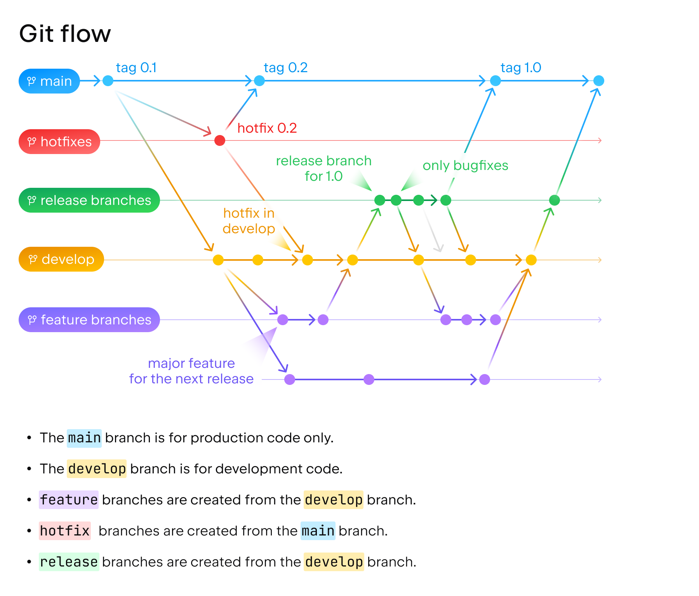

# Metalhead Robot Wiki - Git

| [Home](../README.md) | [Architecture](../architecture/README.md) | Git | [Configuration](../configuration/README.md) | [Mockups](../mockups/README.md) | [Database](../database/README.md) |  [Project Management](../project-management/README.md) | [Quality](../quality/README.md) |
| :------------------: | :---------------------------------------: | :---------------------: | :-----------------------------------------: | :-----------------------------: | :-------------------------------: |  :---------------------------------------------------: | :-----------------------------: |

- [Metalhead Robot Wiki - Git](#metalhead-robot-wiki---git)
  - [Git](#git)
    - [Acceptance Criteria of Merge Requests](#acceptance-criteria-of-merge-requests)
    - [Git Flow](#git-flow)
    - [Basic Commands](#basic-commands)

## Git

### Acceptance Criteria of Merge Requests

- [x] The branch must be tested.
- [x] The branch must be updated with the development branch.
- [x] The branch must be reviewed.
- [x] The branch must be documented.
- [x] The branch must be following the architecture and the code style.
- [x] The MR must reference the issue that it solves.

### Git Flow

The Git Flow is the following:

- master: The main branch. It contains the latest stable version of the project.
- development: The development branch. It contains the latest version of the project.
- feature/XX-feature-name: The feature branch. It contains the feature that is being developed.
- bugfix/XX-bugfix-name: The bugfix branch. It contains the bugfix that is being developed.
- docs/XX-docs-name: The documentation branch. It contains changes for the documentation.
- refactor/XX-refactor-name: The refactor branch. It contains performance improvements and code refactors.

Examples:

1. `feature-about-page`
2. `refactor-upcoming-requests`

### Basic Commands

- Clone repository: `git clone <GIT_REPOSITORY_URL>`
- Check repository status: `git status`
- Create a new branch: `git checkout -b <BRANCH_NAME>`
- Change branch: `git checkout <BRANCH_NAME>`
- Add all changes to staging: `git add .`
- Create commit package with all staged changes: `git commit -m "<DESCRIBE_CHANGES_HERE>"`
- Push all commit packages to GitHub: `git push origin <BRANCH_NAME>`
- Update branch: `git pull origin <BRANCH_NAME>`
- Merge branch with current branch: `git merge <BRANCH_NAME>`
- Check commit logs: `git log`
- Reset all staged changes: `git restore --staged`
- Reset all changes to HEAD (careful): `git reset --HARD`
