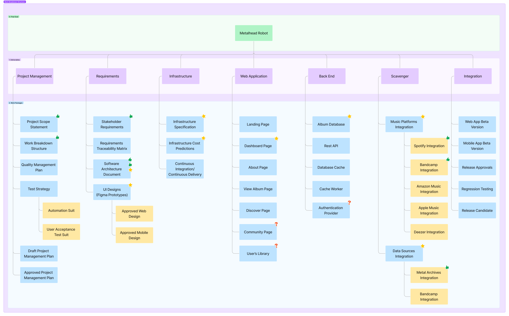

# Metalhead Robot Wiki - Project Management

| [Home](../README.md) | [Architecture](../architecture/README.md) | [Git](../git/README.md) | [Configuration](../configuration/README.md) | [Mockups](../mockups/README.md) | [Database](../database/README.md) | Project Management | [Quality](../quality/README.md) |
| :------------------: | :---------------------------------------: | :---------------------: | :-----------------------------------------: | :-----------------------------: | :-------------------------------: | :----------------- | :-----------------------------: |

- [Metalhead Robot Wiki - Project Management](#metalhead-robot-wiki---project-management)
  - [Project Management](#project-management)
    - [Project Warm-up](#project-warm-up)
    - [User Stories](#user-stories)
      - [Initial Scope](#initial-scope)
      - [Nice to Have](#nice-to-have)
      - [US that actually are Acceptance Criteria](#us-that-actually-are-acceptance-criteria)
    - [Work Breakdown Structure](#work-breakdown-structure)
    - [Working with user stories](#working-with-user-stories)
      - [User Stories Life-Cycle](#user-stories-life-cycle)
      - [How to write user stories](#how-to-write-user-stories)
      - [User story template and examples](#user-story-template-and-examples)

## Project Management

Consider the table below to identify the meaning of each status:

| Figure | Meaning                        |
| :----: | :----------------------------- |
|   ✅    | User Story accepted            |
|   ❌    | User Story not accepted        |
|   ⚠️    | User Story with technical debt |
|   ⏳    | User Story in progress         |
|   😴    | User Story not started         |

### Project Warm-up

Consider the table below to identify the status of the project:

| Description                   | Accepted | Not Accepted | In Progress | Technical Debit | Not Started |
| :---------------------------- | :------: | :----------: | :---------: | :-------------: | :---------: |
| Requirements Elicitation      |    ✅     |              |             |                 |             |
| User Stories Definition       |    ✅     |              |             |                 |             |
| Creation of Mockups           |          |              |      ⏳      |                 |             |
| Initial Setup - Design System |          |              |      ⏳      |                 |             |
| Initial Setup - UI            |    ✅     |              |             |                 |             |
| Initial Setup - API           |          |              |             |                 |      😴      |
| Initial Setup - DB            |          |              |      ⏳      |                 |             |
| Initial Setup - Scavenger     |    ✅     |              |             |                 |             |

### User Stories

#### Initial Scope

|   #   | User Story                                                                                                                                                                     | Category | Accepted | Not Accepted | Technical Debt | In Progress |
| :---: | :----------------------------------------------------------------------------------------------------------------------------------------------------------------------------- | :------: | :------: | :----------: | :------------: | :---------: |
|   1   | As a user, I want to see a landing page explaining the potential of Metalhead Robot, so I can understand the goal of the application when I first access the website.          |   Page   |          |              |                |             |
|   2   | As a user, I want to view the latest releases when I access the dashboard, so I can discover new music.                                                                        |   Page   |          |              |                |             |
|   3   | As a user, I want to see the most popular heavy metal releases when I access the dashboard, so I can discover what other metalheads are listening.                             |   Page   |          |              |                |             |
|   4   | As a user, I want to see a list of upcoming metal releases when I access the dashboard, so that I can keep track of upcoming albums and plan my listening schedule.            |   Page   |          |              |                |             |
|   5   | As a user, I want to view detailed information about a release when I select a release card, so that I can learn more in-depth about an album.                                 |   Page   |          |              |                |             |
|   6   | As a user, I want to have the ability to send user feedback, such as suggestions and bug reports, so I can improve the app and receive a better user experience.               |   Page   |          |              |                |             |
|   7   | As a user, I want to be able to filter the releases by multiple attributes, such as genre, country, and release date, so I can easily find releases that match my preferences. |   Data   |          |              |                |             |
|   8   | As a user, I want to view the artist for each album, so I can understand which band the release belongs to.                                                                    |   Data   |          |              |                |             |
|   9   | As a user, I want to view the album title of a release, so I can find the album I want to listen to.                                                                           |   Data   |          |              |                |             |
|  10   | As a user, I want to view the type of a release (single, EP, full-length, demo, etc), so I can find music the type of album I want to listen to.                               |   Data   |          |              |                |             |
|  11   | As a user, I want to view the genre of each album so I can find the type of music I like.                                                                                      |   Data   |          |              |                |             |
|  12   | As a user, I want to view the release date of each album, so I can see how recently the album was released.                                                                    |   Data   |          |              |                |             |
|  13   | As a user, I want to see the album cover for each album so I can have a visual representation of the music.                                                                    |   Data   |          |              |                |             |
|  14   | As a user, I want to view the different streaming platforms available for a release, so I can listen to the music I like on my favorite platform.                              |   Data   |          |              |                |             |
|  15   | As a user, I want to view the country of origin of a release, so I can discover music from different parts of the world.                                                       |   Data   |          |              |                |             |
|  16   | As a user, I want to be able to see the total duration of a release, so I know how long it takes to listen to an entire release                                                |   Data   |          |              |                |             |
|  17   | As a user, I want to view the tracklist for each album so I can see what songs are included.                                                                                   |   Data   |          |              |                |             |
|  18   | As a user, I want to be able to share metal releases on social media, so that I can introduce my friends to new music.                                                         | Actions  |          |              |                |             |
|  19   | As a user, I want to be able to listen to samples of each album, so I can decide if I want to listen to the full album.                                                        | Actions  |          |              |                |             |
|  20   | As a user, I want to be able to see which albums I've already listened to so I don't accidentally listen to the same album twice.                                              | Actions  |          |              |                |             |

#### Nice to Have

User stories considered nice-to-have means that they are **not** included in the initial scope of the project.

- *As a user, I want to be able to listen to a heavy metal radio, so I can listen and discover new music.*
- *As a user, I want to be able to select the preferences of what is playing on the radio, so I can listen and discover new music I like.*
- *As a user, I want to see a visual representation of metrics about the releases (e.g. releases by day/week/month) , so I can understand the heavy metal scene in an easy-to-understand format.*
- *As a user, I want to be able to view a list of music videos from Youtube, so I can listen the music while watching the clip.*
- *As a user, I want to be able to view a list of metal magazines and websites, so that I can stay up-to-date with the latest news and reviews.*
- *As a user, I want to be able to rate albums so I can provide feedback on the music I listen to.*
- *As a user, I want to be able to view the average rating and number of reviews for a metal release, so that I can get an idea of its popularity and quality.*
- *As a user, I want to be able to bookmark specific albums so I can easily find them again in the future.*
- *As a user, I want to be able to view my favorite releases, so I can quickly access my bookmarks.*
- *As a user, I want to be able to view the biography of the band that released the music, so I can learn more about the band.*
- *As a user, I want to be able to view the metal record label(s) behind the release, so that I can learn more about the companies behind the music.*
- *As a user, I want to be able to view a list of metal podcasts, so that I can listen to discussions and interviews about the genre.*
- *As a user, I want to be able to search for specific albums or artists so I can quickly find what I'm looking for.*
- *As a user, I want to view a breakdown of the latest heavy metal releases by country, so I can see the popularity of different countries.*
- *As a user, I want to view a breakdown of the latest heavy metal releases by genre, so I can see the popularity of different genres.*
- *As a user, I want to view a breakdown of the latest releases by type (such as single, EP, full-length, etc), so I can see the popularity of different release types*
- *As a user, I want to be able to see the lyrics of the songs of a release, so I can sing along while I listen to the music.*

#### US that actually are Acceptance Criteria

- As a user, I want to be able to sort the list of metal releases by release date, so that I can view the newest releases first.
- As a user, I want to be able to view a message when there is no data to be displayed, so I can understand the state of the application.

### Work Breakdown Structure

### Working with user stories

#### User Stories Life-Cycle

1. Generally a story is written by the product owner, product manager, or program manager and submitted for review.
2. During a sprint or iteration planning meeting, the team decides what stories they’ll tackle that sprint.
3. Teams now discuss the requirements and functionality that each user story requires. This is an opportunity to get technical and creative in the team’s implementation of the story.
4. Once agreed upon, these requirements are added to the story.
5. Another common step in this meeting is to score the stories based on their complexity or time to completion. Teams use t-shirt sizes, the Fibonacci sequence, or planning poker to make proper estimations. **A story should be sized to complete in one sprint**, so as the team specs each story, they make sure to break up stories that will go over that completion horizon.  

#### How to write user stories

Consider the following when writing user stories:

- Definition of “done” — The story is generally “done” when the user can complete the outlined task, but make sure to define what that is.
- Outline subtasks or tasks — Decide which specific steps need to be completed and who is responsible for each of them.
- User personas — For whom? If there are multiple end users, consider making multiple stories.
- Ordered Steps — Write a story for each step in a larger process.
- Listen to feedback — Talk to your users and capture the problem or need in their words. No need to guess at stories when you can source them from your customers.  
- Time — Time is a touchy subject. Many development teams avoid discussions of time altogether, relying instead on their estimation frameworks. Since stories should be completable in one sprint, stories that might take weeks or months to complete should be broken up into smaller stories or should be considered their own epic.

#### User story template and examples

Pattern: **"As a [persona], I [want to], [so that]"** (Persona + need + purpose)

- **"As a [persona]"**: Who are we building this for? We’re not just after a job title, we’re after the persona of the person. Max. Our team should have a shared understanding of who Max is. We’ve hopefully interviewed plenty of Max’s. We understand how that person works, how they think and what they feel. We have empathy for Max.
- **“Wants to”**: Here we’re describing their intent — not the features they use. What is it they’re actually trying to achieve? This statement should be implementation free — if you’re describing any part of the UI and not what the user goal is you're missing the point.
- **“So that”**: how does their immediate desire to do something this fit into their bigger picture? What’s the overall benefit they’re trying to achieve? What is the big problem that needs solving?
